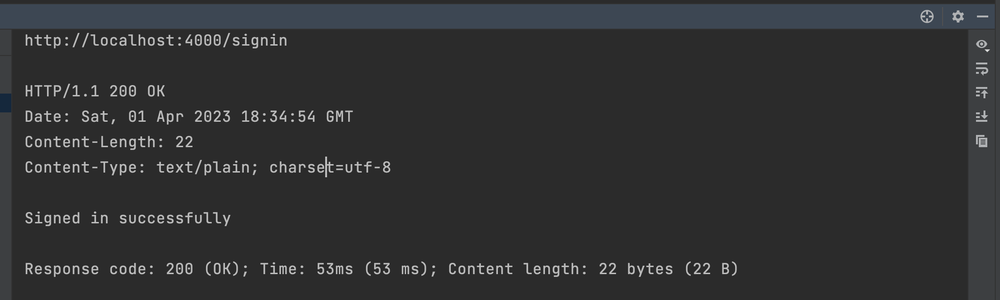
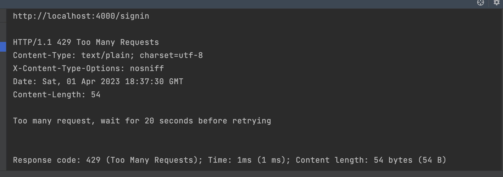

# RateLimitAPI


I was asked to implement a simple webserver with rate limit feature as an assignment for data security course.
In the following I will explain some details of what I have implemented.

- [Requirements](#requirements)
- [Features](#features)
- [Implementation](#implementation)
- [Installation](#installation)
- [Output](#output)
- [Contribution](#contribution)
- [License](#license)

## Requirements

In order to run the program consider installing golang v1.20.2 on the system and add the executable path on the terminal known Paths.

| Platform   | Minimum Go Version | Status |
|------------|--------------------|--------|
| macOS 13.2 | 1.20.2             | Tested |

## Features

- [x] Used GORM as Store for user's data.
- [x] Used MVC Architecture with abstraction layers.
- [x] Support RateLimit with configurable tokens (per second) and buckets.
- [x] Documented.

## Implementation

The API consists of following routes which you can use to test rate-limit.

1. root (http://127.0.0.1:4000/)
2. signup (http://127.0.0.1:4000/signup)
3. signin (http://127.0.0.1:4000/signin)

### Registration And Authentication

In order to sign up or sign in, you should send a Get request with `JSON` content-type and two parameter in request body:

1. username
2. password

> The API will complain if username already picked on signup, or it is invalid on sign in.

### How Rate-Limit Was Implemented

I have used rate package which contains `NewLimiter` struct.
This structure models the [token bucket](https://en.wikipedia.org/wiki/Token_bucket) rate-limiter algorithm.

It can easily be used to instantiate a `NewLimiter` with specified rate and bucket,
to limit clients accessing in certain amount of time and the number of attempts they could make.

you can change the rate and bucket to observe different time and attempts you can make.
Based on the parameter on `main.go` line 22:

```go
limiter := Middlewares.NewRateLimiter(20, 1)
```
The code above set the rate at 20 seconds between each request and bucket to 1 meaning that in every 20 seconds we can make just 1 attempt to send request, 
otherwise API will complain with `too many request` error with such response:

```plain
http://localhost:4000/[One of the routes]

HTTP/1.1 429 Too Many Requests
Content-Type: text/plain; charset=utf-8
X-Content-Type-Options: nosniff
Date: Sat, 01 Apr 2023 18:37:30 GMT
Content-Length: 54

Too many request, wait for 20 seconds before retrying


Response code: 429 (Too Many Requests); Time: 1ms (1 ms); Content length: 54 bytes (54 B)
```

## Installation

To run application from terminal, `cd` to the root folder of project and run the following commands.

```bash
go install
go run main.go
```

## Output

You can observe the result for sending request twice, as we set the bucket to 1, 
the second time we get `too many request response`

> To test the routes, go to `Test` folder using Jetbrain IDEs and perform HTTP request on [SignInTest](https://github.com/kiarashvosough1999/RateLimitAPI/blob/master/Tests/Tests/SignInTest.http




## Contribution

Feel free to share your ideas or any other problems. Pull requests are welcomed.

## License

RateLimitAPI was released under an MIT license. See [LICENSE](https://github.com/kiarashvosough1999/RateLimitAPI/blob/master/LICENSE) for more information.